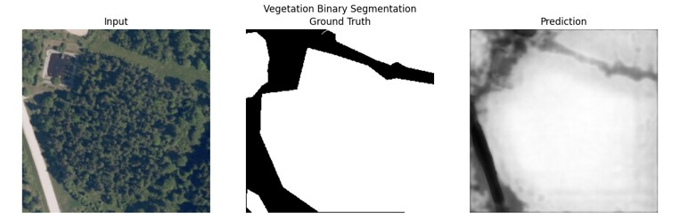
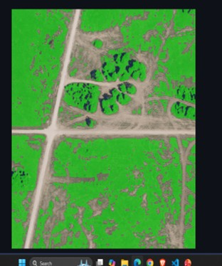
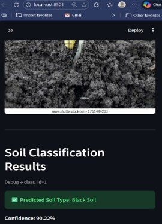
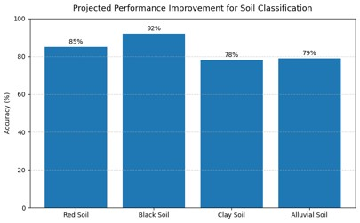
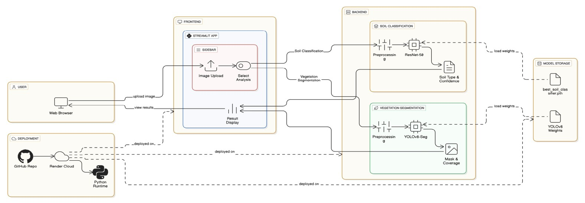

# 🌍 AI-Driven Archaeological Site Mapping

Detecting hidden archaeological sites using vegetation patterns and soil classification through AI.

This project demonstrates how satellite imagery can be analyzed using deep learning to identify potential archaeological locations by studying vegetation density and soil characteristics.

🔗 **Live Demo**: https://archaeological-frontend-one.vercel.app/

---

## 📌 Overview

Traditional archaeological surveys are time-consuming and limited in scale.
This system explores how AI can assist in large-scale terrain analysis using:

* 🌱 Vegetation anomaly detection
* 🧱 Soil classification
* 🛰️ Satellite image segmentation

---

## 📸 Screenshots & Demo

---

## 🛰️ Vegetation Segmentation

*Satellite input image → Ground truth → Model prediction.
The model segments vegetation regions to detect anomalies that may indicate buried structures.*

---

## 🌱 Vegetation Coverage Mapping

*Detected vegetation regions highlighted in green.
Variations in vegetation density help identify unusual terrain patterns.*

---

## 🧱 Soil Classification

*The system classifies soil types from input images.
Example: **Black Soil** predicted with high confidence (~90%).*

---

## 📊 Performance Analysis

*Model performance across different soil types showing strong classification accuracy.*

---

## 🧠 System Architecture

*End-to-end pipeline from user input → model processing → prediction output.*

---

## 🔬 Methodology

1. **Data Input**

   * Satellite / aerial imagery

2. **Preprocessing**

   * Image normalization
   * Resizing & enhancement

3. **Vegetation Segmentation**

   * Deep learning model (U-Net / YOLO-based segmentation)
   * Extraction of vegetation regions

4. **Soil Classification**

   * CNN-based classifier (ResNet-based)
   * Predict soil type & confidence

5. **Analysis**

   * Vegetation density variation
   * Soil pattern interpretation
   * Detection of anomalies

---

## 🚀 Key Features

* 🌱 Vegetation density analysis
* 🧱 Soil classification system
* 🛰️ Satellite image processing
* 🧠 Deep learning-based segmentation
* 📊 Visual performance insights
* 🔍 Detection of potential archaeological zones

---

## 🌍 Applications

* 🏛️ Archaeological site discovery
* 🌱 Vegetation anomaly detection
* 🧱 Soil-based terrain analysis
* 🛰️ Remote sensing research
* 📍 Heritage preservation

---

## ⚠️ Limitations

* Dependent on image quality & resolution
* Dense vegetation may hide features
* Requires high-quality labeled data

---

## 🔮 Future Improvements

* Multi-spectral image support
* Integration with GIS systems
* Real-time mapping dashboard
* Drone-based data collection
* Hybrid detection (segmentation + object detection)

---

## 🛠️ Tech Stack

* Python
* OpenCV
* PyTorch / TensorFlow
* U-Net / YOLO (Segmentation)
* ResNet (Classification)
* NumPy, Matplotlib

---

## 📂 Project Structure

assets/

* segmentation.png
* vegetation_map.png
* soil_result.png
* performance.png
* architecture.png

---

## 📌 Key Insight

Vegetation growth patterns and soil variations can reveal hidden underground structures.
This project shows how AI can assist archaeologists in identifying such patterns efficiently.

---

## 👨‍💻 Author

**Hitanshu Vaidya**

---

## ⭐ If you found this interesting, consider giving a star!
